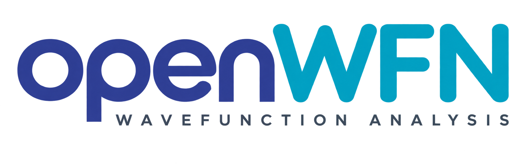
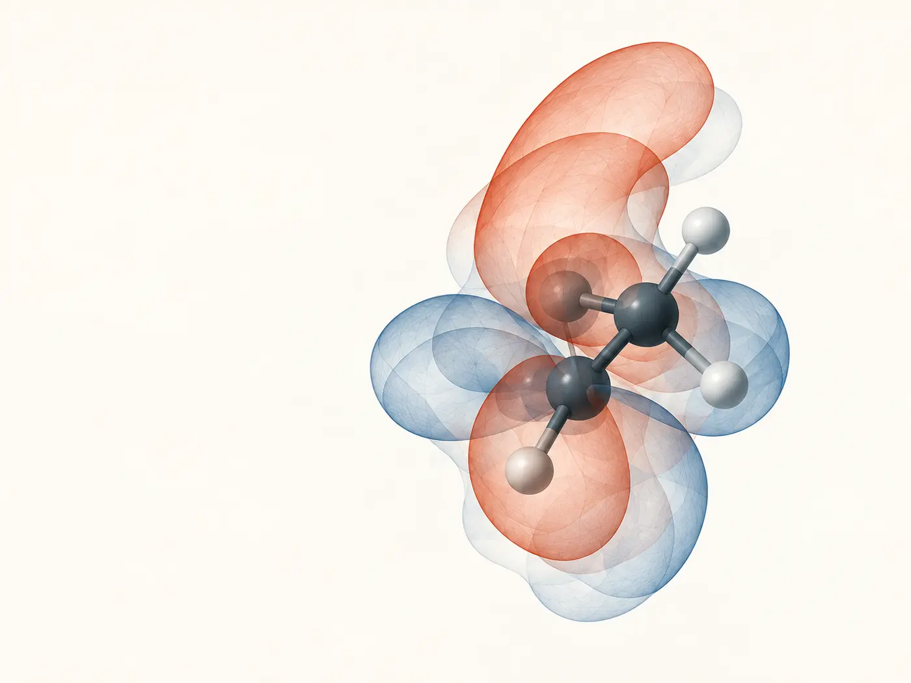

<section class="ow-hero">
  

<h1>Wavefunction analysis you can inspect, reproduce, and trust.</h1>

openWFN is an open, reproducible wavefunction analysis toolkit for computational chemistry. It turns Gaussian formatted-checkpoint data into molecular geometry, orbitals, electron density, atomic populations, electrostatic potential, reports, and a portable 3D workbench—without sending research data to a remote service.

  <a class="ow-button ow-button--primary" href="start/first-analysis/">Get started</a>
  <a class="ow-button" href="reference/cli/">Explore the CLI</a>

Python 3.10–3.13 · MIT licensed · openWFN 0.7.0

  

  

    
  

</section>

## One workbench, every stage of analysis

Begin with the structure, move into electronic properties, and preserve every result in a form that can be checked later.

:material-ruler-square:
### Geometry
Distances, angles, signed dihedrals, covalent-radius bonds, and connected fragments.

:material-orbit-variant:
### Orbitals
Alpha or beta frontier levels, HOMO, LUMO, occupations, and energy-gap reporting.

:material-blur:
### Electron density
Total, alpha, beta, and spin-density evaluation, integration, and cube export.

:material-chart-bubble:
### Population analysis
Mulliken and symmetric Löwdin populations with model-dependent atomic charges.

:material-flash:
### Electrostatic potential
Nuclear, charge-model, and experimental grid-derived point potentials.

:material-file-chart:
### Research output
JSON, CSV, figures, structures, batch manifests, reports, and offline visualization.

## From a file to a reproducible result

<strong>1 · Inspect</strong>Confirm molecular identity and discover which scientific records are available.

<strong>2 · Analyze</strong>Run explicit commands with documented units, assumptions, and numerical controls.

<strong>3 · Verify</strong>Check capability status, convergence, limitations, and provenance before interpretation.

<strong>4 · Share</strong>Export machine-readable evidence, a fixed report, or a portable local workbench.

Terminalwater.fchk

<pre><code>$ openwfn water.fchk doctor
Doctor
Input: water.fchk
Capabilities: {'basis': True, 'orbitals': True, 'density': True}
Status: Stable

$ openwfn water.fchk orbitals frontier
HOMO       -0.477229 hartree
LUMO        0.261095 hartree
Gap         0.738323 hartree

$ openwfn water.fchk workbench water.html</code></pre>

## Evidence is part of the interface

Every capability carries an explicit evidence boundary. A command completing successfully is not, by itself, a claim of universal scientific validity.

  
<strong>Stable</strong>Implemented and regression tested

  
<strong>Validated</strong>Quantitative evidence for named fixtures

  
<strong>Experimental</strong>Usable with documented caution

  
<strong>Unsupported</strong>Missing records, method, or evidence

[Review the Validation matrix](science/validation-status.md) · [Understand the Limitations](limitations.md)

## Choose your path

  
<strong>For researchers</strong>
Evaluate methods, numerical evidence, provenance, reports, and citation guidance.
<a href="start/learning-paths/#researcher-path">Research workflow →</a>

  
<strong>For students</strong>
Build concepts from coordinates and orbitals through density, charges, and ESP.
<a href="start/learning-paths/#student-path">Learning path →</a>

  
<strong>For developers</strong>
Use the typed Python model and extend parsers, analyses, exporters, and tests.
<a href="start/learning-paths/#developer-path">Developer path →</a>

## Local by design

Scientific computation happens on your computer. Generated reports, cube files, and HTML workbenches can still contain unpublished molecular data, so treat them with the same controls as the source calculation. Read [Security and data privacy](project/security.md).

**From checkpoint data to defensible molecular insight.**

**Current release:** openWFN 0.7.0 · [Release notes](releases/0.7.0.md) · [Citation](citation.md) · [GitHub](https://github.com/sha786muhammed/openWFN)

